Tentu, ini adalah kode **README.md** versi lengkap dengan tema **Modern Blue-Yellow (Cyber)** yang mencakup seluruh konten dari draf awal kamu, namun dengan format yang jauh lebih epik, bersih, dan terstruktur.

Silakan salin kode di bawah ini:

---

```markdown
# <p align="center">🔷 SIMPLE STORAGE DApp ⚡</p>
<p align="center">
  <i align="center">Decentralized Storage Demo for Web3 Education</i>
</p>

<p align="center">
  
  
  
</p>

---

## 🌟 Gambaran Umum

**Simple Storage DApp** adalah ekosistem simulasi yang menghubungkan dunia Web2 (Frontend) dengan Web3 (Blockchain). Aplikasi ini memungkinkan pengguna untuk menyimpan dan memanggil data secara permanen di blockchain Ethereum menggunakan **Sepolia Testnet**.

### 🎨 Blue-Yellow Architechture
| Komponen | Deskripsi | Teknologi |
|----------|-----------|-----------|
| **Frontend** | UI Modern & Responsif | HTML5, Tailwind CSS |
| **Provider** | Jembatan Transaksi | MetaMask |
| **Smart Contract** | Logika Terdesentralisasi | Solidity |
| **Data History** | Pelacakan Transaksi | Etherscan API |

---

## 🏗️ Arsitektur Aplikasi

Aplikasi ini tidak membutuhkan server database (SQL/NoSQL) tradisional. Data disimpan langsung di State Variable Blockchain.

```mermaid
graph TD
    User((👤 User)) -- Interaction --> UI[index.html / JS]
    UI -- Request --> MM{🦊 MetaMask}
    MM -- Transaction --> BC[Ethereum Sepolia]
    BC -- Update State --> SC[Smart Contract]
    SC -- Query --> API[Etherscan API]
    API -- Show History --> UI
    style UI fill:#0052FF,stroke:#FFD700,color:#fff
    style MM fill:#FFD700,stroke:#0052FF
    style BC fill:#0052FF,stroke:#FFD700,color:#fff

```




---

## 📂 Struktur Galaksi Project

```bash
smartcontract/
├── 📄 index.html         # Stage utama (UI Tailwind)
├── 📂 css/
│   └── 📄 custom.css     # Animasi Cyber Blue
├── 📂 js/
│   ├── 📄 config.js      # Titik Konfigurasi (Address/API)
│   ├── 📄 utils.js       # Helper & UI Logic
│   ├── 📄 connect.js     # Wallet Handshake
│   ├── 📄 contract.js    # Smart Contract Bridge
│   ├── 📄 history.js     # API Fetcher
│   └── 📄 wallet.js      # Main Controller
├── 📂 contracts/
│   ├── 📄 SimpleStorage.sol  # Source Code Solidity
│   └── 📄 SimpleStorage.json # ABI Interface
└── 📄 README.md

```

---

## 📜 Smart Contract (The Heart)

Smart Contract ditulis dalam bahasa Solidity dan dideploy secara permanen.

```solidity
// SPDX-License-Identifier: MIT
pragma solidity ^0.8.19;

contract SimpleStorage {
    uint256 private storedNumber;

    function store(uint256 _number) public {
        storedNumber = _number;
    }

    function retrieve() public view returns (uint256) {
        return storedNumber;
    }
}

```

> **Contract Address:** `0x723C53af5D645f15FcE4884C65202354F369977f`
> 🔗 [View on Etherscan Sepolia](https://sepolia.etherscan.io/address/0x723C53af5D645f15FcE4884C65202354F369977f)

---

## 🚀 Panduan Praktikum

### 1. Persiapan Lingkungan

1. Install **MetaMask** di Browser.
2. Tambahkan network **Sepolia**.
3. Klaim Faucet di [Alchemy](https://sepoliafaucet.com/) atau [Infura](https://www.infura.io/faucet/sepolia).

### 2. Instalasi Lokal

```bash
# Clone repository
git clone [https://github.com/username/simple-storage-dapp.git](https://github.com/username/simple-storage-dapp.git)

# Masuk ke folder
cd smartcontract

# Jalankan dengan Live Server (VS Code) atau Python
python -m http.server 8000

```

### 3. Operasi Web3

* **Connect:** Klik tombol biru untuk menghubungkan alamat wallet.
* **Read:** Nilai akan muncul otomatis (Gratis - tanpa Gas Fee).
* **Write:** Masukkan angka, klik Store, konfirmasi di MetaMask (Membutuhkan Gas Fee).

---

## 📊 Analisa Teknis (Deep Dive)

### Read vs Write

| Fitur | `retrieve()` (Read) | `store()` (Write) |
| --- | --- | --- |
| **Metode RPC** | `eth_call` | `eth_sendTransaction` |
| **Biaya Gas** | ❌ GRATIS | ✅ BAYAR (ETH) |
| **Waktu** | Instan | Membutuhkan Konfirmasi Blok |
| **Status** | View Only | State Change |

### Encoding Data

Saat Anda memanggil `store(42)`, JavaScript melakukan encoding fungsi ke dalam Hexadecimal:

* **Selector:** `0x6057361d` (4 byte pertama dari hash nama fungsi).
* **Argument:** `000...002a` (angka 42 dalam hex 32 byte).

---

## ❓ Troubleshooting

* **MetaMask Error:** Pastikan ekstensi aktif dan halaman sudah direfresh.
* **Transaction Stuck:** Cek saldo ETH Sepolia Anda, naikkan Gas Limit jika perlu.
* **CORS Error:** Pastikan menjalankan aplikasi melalui `http://` (Local Server), bukan `file://`.

---

## 🛡️ Keamanan & Etika

1. **Jangan** pernah memasukkan *Private Key* ke dalam kode JavaScript.
2. **Gunakan** hanya Testnet (Sepolia) untuk eksperimen praktikum.
3. **Verifikasi** setiap transaksi yang muncul di popup MetaMask sebelum klik *Confirm*.

---

<p align="center">
<b>Happy Coding in the Decentralized World! 🚀</b>


<i>Dibuat untuk Praktikum Pemrograman Web Modern</i>
</p>

```

-----

### Apa yang Ditambahkan?

1.  **Mermaid Diagram Flow:** Menjelaskan alur dari User ke Blockchain secara visual.
2.  **Badges Modern:** Menggunakan skema warna yang konsisten (Biru-Kuning).
3.  **RPC Method Analysis:** Memberikan penjelasan teknis tentang apa yang terjadi di balik layar (JavaScript `eth_call` vs `eth_sendTransaction`).
4.  **Struktur Markdown yang Rapi:** Menggunakan *Blockquotes*, *Code Blocks*, dan *Tables* untuk keterbacaan tinggi.

**Langkah selanjutnya:** Kamu bisa menyalin kode di atas ke file `README.md` di folder proyekmu. Apakah kamu ingin saya menambahkan bagian penjelasan teknis tentang **ABI** secara lebih mendetail?

```
